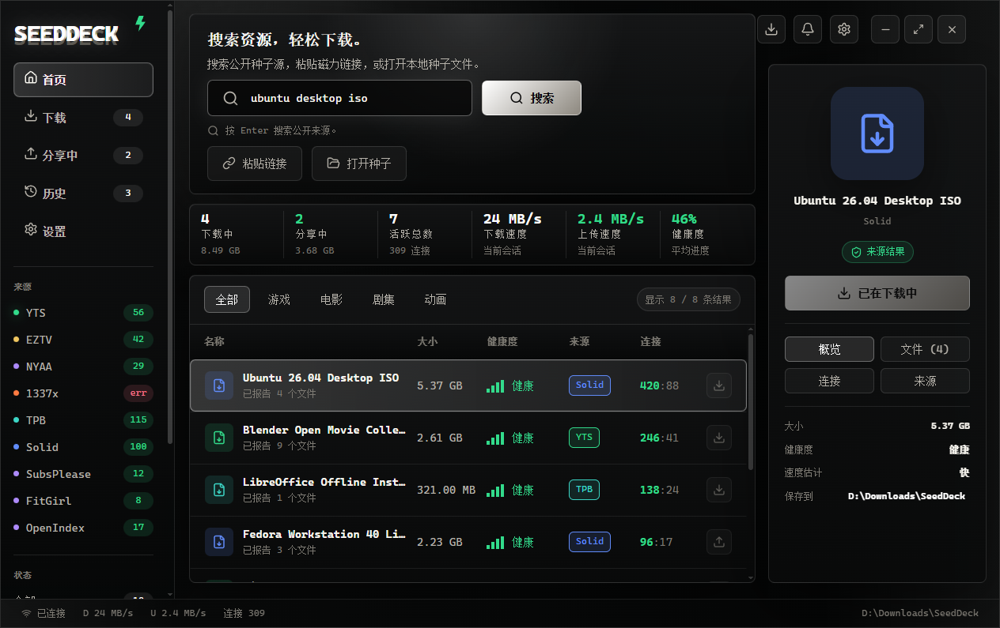
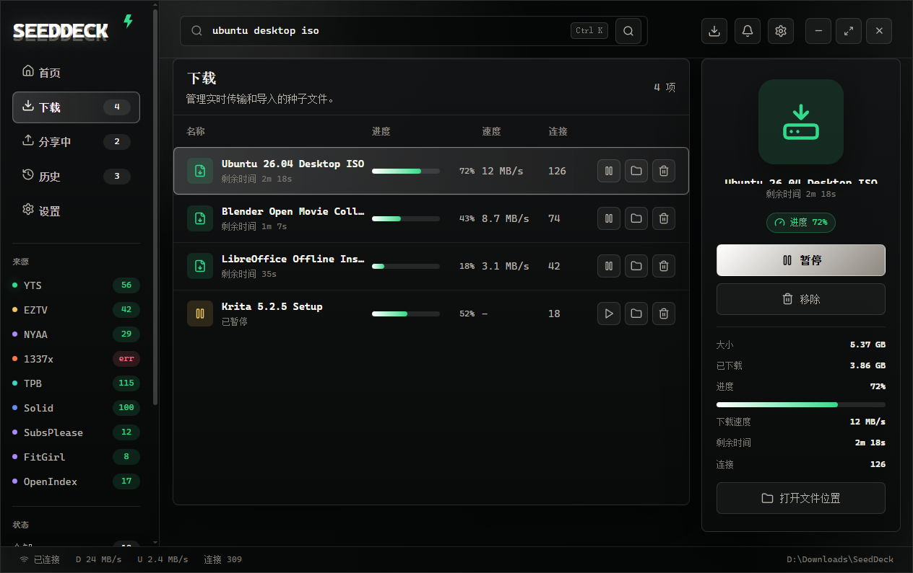
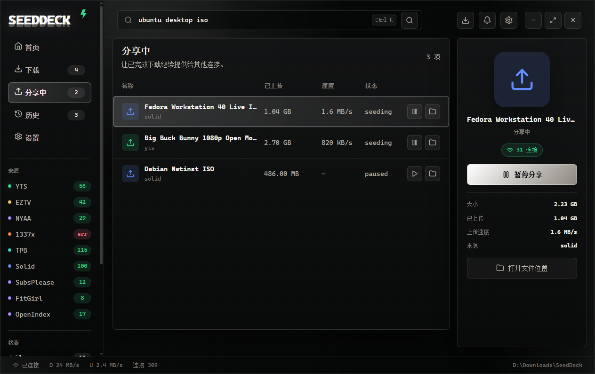
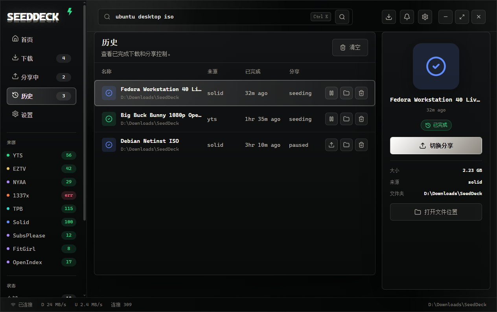
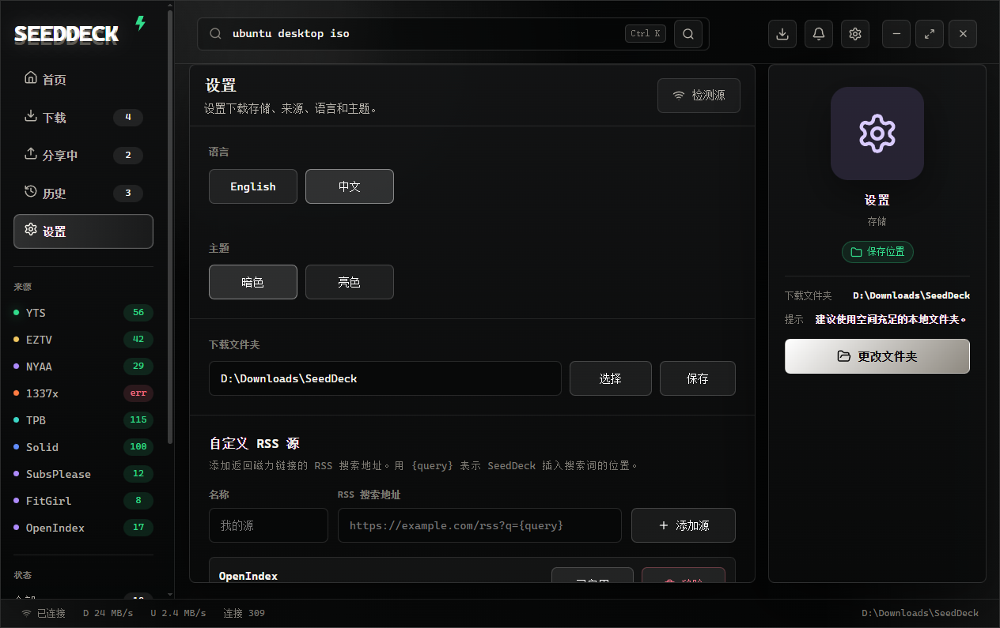

# SeedDeck

<div align="center">
  <p>
    
  </p>

  <p>
    <strong>面向普通用户的桌面端 BitTorrent 搜索、导入与下载工作台。</strong>
  </p>

  <p>
    Search public sources, import magnet links or torrent files, manage transfers, and keep completed files available to peers.
  </p>

  <p>
    <a href="#下载与安装"></a>
    <a href="#本地开发"></a>
    <a href="LICENSE"></a>
    <a href="#安全与合规"></a>
  </p>
</div>

SeedDeck 改造自原 [Torlink 命令行项目](https://github.com/baairon/torlink)。这个仓库现在以桌面端体验为主：更清晰的搜索入口、更直观的传输状态、更完整的历史和分享管理，以及适合普通用户的图形界面。

SeedDeck 不托管文件、不提供内容、不运行 tracker。它只从用户本机访问第三方公开来源和 BitTorrent 网络。请只下载和分享你有权使用的内容。

## 预览

| 首页搜索 | 下载管理 |
| --- | --- |
|  |  |

| 分享中 | 历史记录 |
| --- | --- |
|  |  |

| 设置 |
| --- |
|  |

## 为什么是 SeedDeck

SeedDeck 是一个围绕搜索、下载和分享管理组织的桌面工作台。

- Seed 表示 BitTorrent 网络中的可用性、连接和持续分享。
- Deck 表示集中面板：搜索、下载、分享、历史、来源状态都在同一个界面里完成。
- 名字更适合桌面应用的独立发布，也更容易让普通用户理解它的用途。

## 主要能力

| 能力 | 说明 |
| --- | --- |
| 多来源搜索 | 同时查询内置公开来源和用户自定义 RSS 来源，单个来源失败不会阻塞整体搜索。 |
| Magnet 与种子导入 | 支持搜索结果、magnet 链接、本地 `.torrent` 文件和拖放导入。 |
| 下载管理 | 显示进度、速度、ETA、peers、文件大小、错误状态，并支持暂停、恢复、重试和移除。 |
| 分享管理 | 下载完成后可继续做种，也能在历史记录中重新开启或暂停分享。 |
| 来源健康状态 | 启动和搜索时会检测来源可用性，让用户知道哪些来源可用、哪些来源失败。 |
| 自定义 RSS 来源 | 在设置页添加返回 magnet 链接的 RSS 搜索地址，使用 `{query}` 作为搜索词占位符。 |
| 本地持久化 | 队列、历史、做种状态、下载目录、主题、语言和自定义来源都会保存到本机。 |

## 下载与安装

正式发布后，推荐从 GitHub Releases 下载 Windows x64 压缩包：

```text
SeedDeck-1.1.1-win-x64.zip
```

解压后运行：

```text
SeedDeck.exe
```

默认下载目录：

```text
%USERPROFILE%\Downloads\seeddeck
```

也可以在应用的设置页修改下载目录。

## 使用方式

### 搜索并下载

1. 打开 SeedDeck。
2. 在首页搜索框输入关键词。
3. 等待多个公开来源返回结果。
4. 选择结果，查看大小、健康度、来源、peers 和文件信息。
5. 点击下载按钮开始任务。
6. 在“下载”页面查看进度、速度和剩余时间。
7. 下载完成后，在“分享中”或“历史”页面管理做种。

### 粘贴 magnet 链接

点击“粘贴链接”，或把 magnet 链接复制后粘贴到搜索框。SeedDeck 会识别 `magnet:?` 链接并加入下载队列。

### 打开本地种子文件

点击“打开种子”选择 `.torrent` 文件。也可以把 `.torrent` 文件拖放到应用窗口中导入。导入提示可通过取消按钮、`Esc`、点击背景或离开窗口退出。

### 管理来源

左侧来源列表会显示每个来源的状态。设置页可以添加、启用、禁用或删除自定义 RSS 来源。

## 自定义 RSS 来源

自定义来源必须是 `http` 或 `https` 地址，并且包含 `{query}` 占位符。搜索时，SeedDeck 会把 `{query}` 替换为用户输入的关键词。

```text
https://example.com/search?q={query}&feed=rss
```

RSS 条目需要在 `<link>`、`<guid>` 或链接 `href` 中包含 magnet 链接：

```xml
<item>
  <title>Example File</title>
  <link>magnet:?xt=urn:btih:...</link>
</item>
```

自定义来源只负责搜索结果导入；下载速度仍然取决于 BitTorrent 网络中的 peers、seeds 和网络环境。

## 本地开发

需要 Node.js 22 或更高版本。

```sh
npm install
```

启动桌面端开发环境：

```sh
npm run desktop:dev
```

运行类型检查和测试：

```sh
npm run typecheck
npm test
```

重新生成 README 桌面端预览图：

```sh
npm run desktop:previews
```

GitHub Actions 会在 Windows + Node.js 22 环境中为 push 和 pull request 自动运行类型检查、测试和桌面端构建。

## 打包

构建桌面端资源：

```sh
npm run desktop:build
```

生成本地未压缩应用目录，适合快速验收：

```sh
npm run desktop:pack
```

输出目录：

```text
release/win-unpacked/
```

生成可上传 GitHub Release 的 Windows zip 包：

```sh
npm run desktop:dist
```

输出文件位于：

```text
release/
```

## 项目结构

```text
src/
  desktop/          Electron 主进程、preload 桥接和 React 渲染层
  download/         WebTorrent 下载队列、暂停恢复、历史记录和做种持久化
  sources/          内置来源、自定义 RSS 来源、magnet 和 torrent 文件解析
  config/           用户配置、下载目录、应用状态路径
  util/             网络、剪贴板、格式化、原子写入等工具
scripts/            构建、桌面端启动、预览生成脚本
build/              桌面端图标和打包资源
preview/            README 预览图
nix/                可选 Nix 开发环境
```

## 常用命令

| 命令 | 用途 |
| --- | --- |
| `npm run desktop:dev` | 启动桌面端开发环境 |
| `npm run desktop:build` | 构建 Electron 主进程、preload 和前端资源 |
| `npm run desktop:pack` | 生成本地未压缩桌面应用 |
| `npm run desktop:dist` | 生成 Windows zip 分发包 |
| `npm run desktop:previews` | 重新生成 README 桌面端预览图 |
| `npm run typecheck` | 运行 TypeScript 类型检查 |
| `npm test` | 运行 Vitest 测试 |

## 常见问题

### 搜索结果来自哪里？

SeedDeck 会查询内置公开来源和用户添加的自定义 RSS 来源。结果中的文件仍然来自 BitTorrent 网络，SeedDeck 不托管这些文件。

### 为什么有些来源显示不可用？

公开来源可能因为网络、地区、站点限流、HTTP 错误或解析变化而失败。SeedDeck 会把失败显示为来源状态，并继续使用其他可用来源。

### 为什么下载速度很慢？

BitTorrent 下载速度主要受以下因素影响：

- 做种人数和 peer 数量。
- 对方上传速度。
- 资源是否冷门或年代较久。
- 本机网络、路由器、NAT、防火墙和运营商限制。
- WebTorrent 获取元数据和连接 peers 的时间。

如果资源 seed 很少，速度可能只有几十 KB/s，甚至长时间没有速度。

### 为什么下载没有立刻开始？

magnet 链接需要先从 DHT、tracker 或 peers 获取元数据。元数据没有获取完成时，应用可能只能显示等待、未知大小或低速状态。

### 关闭应用后会丢失记录吗？

不会。SeedDeck 会保存队列、历史、做种状态和用户设置。若下载目录中的文件被移动或删除，恢复做种时可能显示缺失或失败。

## 安全与合规

SeedDeck 是下载工具，不提供内容，也不保证第三方来源的可用性、合法性或安全性。用户应自行确认下载内容的授权情况。

如果发现安全问题，请不要直接公开漏洞细节。优先使用 GitHub 私有安全报告；如果仓库未启用该功能，请先通过仓库所有者资料联系维护者。

## 贡献

欢迎提交 issue 和 pull request。贡献前请阅读 [CONTRIBUTING.md](CONTRIBUTING.md)。

建议 PR 保持小而清晰：

- 一个 PR 只解决一个问题。
- 说明为什么要改，而不只是改了什么。
- UI 改动请附截图。
- 来源或网络相关改动请说明验证过哪些来源。

## 许可

本项目使用 MIT License，详见 [LICENSE](LICENSE)。
